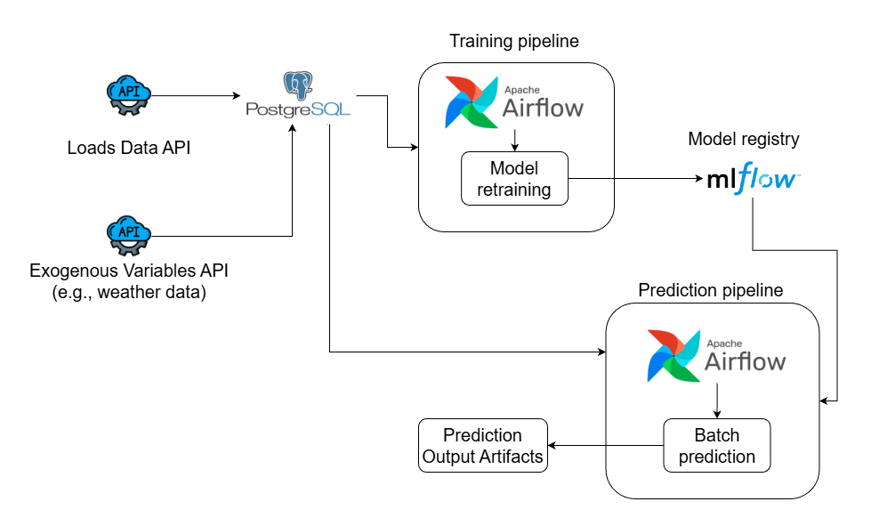
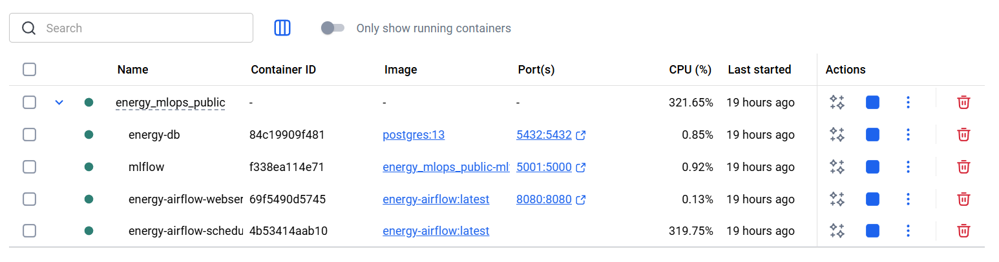
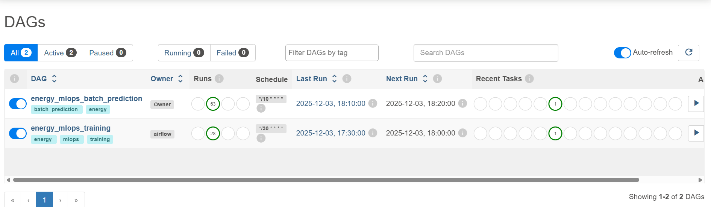
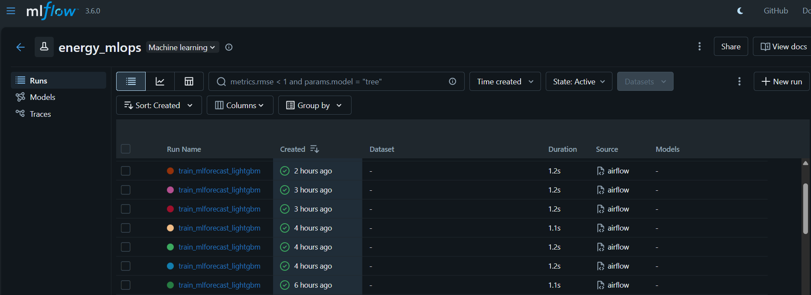
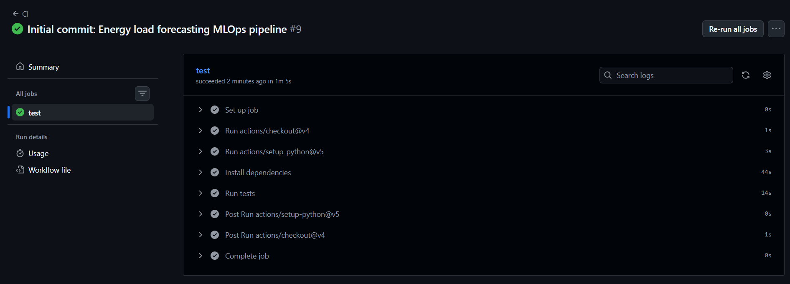
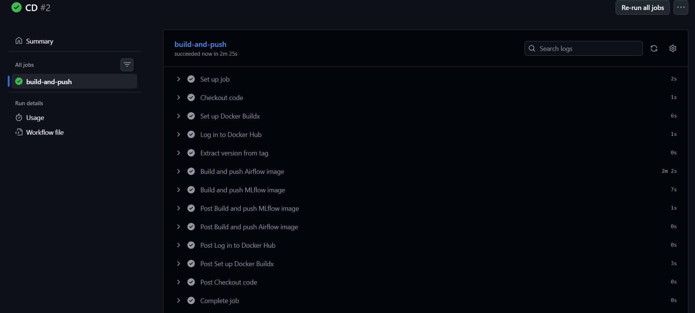
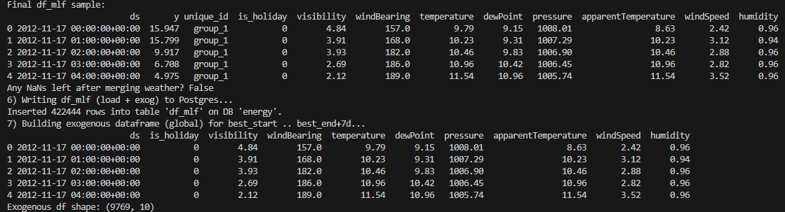
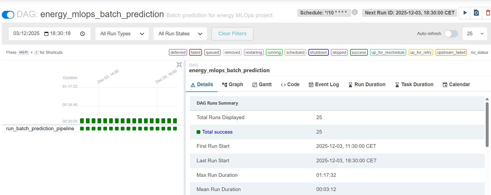

# Energy Load Forecasting MLOps Pipeline

<p align="center">
  
</p>
<p align="center">
  <em>MLOps load forecasting pipeline</em>
</p>

**Production-ready MLOps pipeline for energy load forecasting** using Docker, Airflow, MLflow, and PostgreSQL.

---

## Table of Contents

1. [What This Does](#what-this-does)
2. [Quick Start](#quick-start)
3. [Running Pipelines](#running-pipelines)
4. [Configuration](#configuration)
5. [Development](#development)
6. [CI/CD (Continuous Integration & Deployment)](#cicd-continuous-integration--deployment)
7. [Troubleshooting](#troubleshooting)

---

## What This Does

Forecasts electricity consumption for multiple time series using:
- **MLForecast** + LightGBM for time-series forecasting
- **Airflow** for orchestration and scheduling
- **MLflow** for experiment tracking
- **PostgreSQL** for data storage

**Key Features:**
- Fully Dockerized (no local installs needed)
- Supports both production (Airflow) and development (local Python) workflows
- Automated model selection and evaluation
- Configuration-driven via `config.yaml`

<p align="center">
  
</p>
<p align="center">
  <em>Running containers</em>
</p>

<p align="center">
  
</p>
<p align="center">
  <em>Airflow UI</em>
</p>

<p align="center">
  
</p>
<p align="center">
  <em>MLflow tracking experiments and metrics</em>
</p>

<p align="center">
  
</p>
<p align="center">
  <em>CI workflow running automated tests on every push</em>
</p>

<p align="center">
  
</p>
<p align="center">
  <em>CD workflow building and pushing Docker images to Docker Hub</em>
</p>

---

## Quick Start

### Prerequisites

- Docker (20.10+) and Docker Compose (2.0+)
- Python 3.12 (for local development)
- Kaggle API credentials ([get them here](https://www.kaggle.com/settings))
- **System libraries** (for local Python development with LightGBM):
  ```bash
  # Linux (Debian/Ubuntu)
  sudo apt-get update && sudo apt-get install -y libgomp1
  ```

### Setup (5 minutes)

**1. Clone and setup:**

```bash
git clone https://github.com/rbahmani01/load-forecasting-ml-pipeline.git
cd load-forecasting-ml-pipeline

# Create .env file
cat > .env << 'EOF'
export DB_PASSWORD=your_secure_password_here

# MLflow Configuration
# For local development: Keep this commented out to use local file-based MLflow (./mlruns/)
# For Docker/Airflow: This is automatically set in docker-compose.yml
# export MLFLOW_TRACKING_URI=http://localhost:5001
EOF

source .env
```

**2. Run automated setup:**

```bash
./scripts/setup_fresh.sh
```

This script will:
- Build Docker images
- Start all services (PostgreSQL, MLflow, Airflow)
- Initialize databases
- Create Airflow admin user

**3. Load sample data:**

```bash
# Create Python environment
python3.12 -m venv .venv
source .venv/bin/activate
pip install -r requirements.txt
pip install -e .

# Load Kaggle data into PostgreSQL
source .env
python3 -m scripts.kaggle_to_db_df_mlf
```

<p align="center">
  
</p>
<p align="center">
  <em>Sample data loaded from Kaggle Smart Meters dataset</em>
</p>


**4. Access UIs:**

- **Airflow**: http://localhost:8080 (admin/admin)
- **MLflow**: http://localhost:5001


---

## Running Pipelines

You can run pipelines **two ways** - both work with the same setup:

### Option 1: Via Airflow (Production)

**Best for:** Scheduled workflows, production deployments

```bash
# Trigger training
docker exec energy-airflow-scheduler airflow dags trigger energy_mlops_training

# Trigger prediction
docker exec energy-airflow-scheduler airflow dags trigger energy_mlops_batch_prediction
```

Or use the Airflow UI at http://localhost:8080

<p align="center">
  
</p>
<p align="center">
  <em>Training pipeline executing in Airflow</em>
</p>

### Option 2: From Terminal (Development)

**Best for:** IDE debugging, rapid iteration, unit tests

**Important:** Keep `MLFLOW_TRACKING_URI` commented out in `.env` for local development. If you previously uncommented it, run `unset MLFLOW_TRACKING_URI` in your terminal to clear it.

```bash
# Make sure environment is loaded
source .venv/bin/activate
source .env

# If you previously set MLFLOW_TRACKING_URI, unset it first
unset MLFLOW_TRACKING_URI

# Run training
python3 -c "from energy_forecasting.pipline.training_pipeline import TrainPipeline; TrainPipeline().run_pipeline()"

# Run prediction
python3 -c "from energy_forecasting.pipline.batch_prediction_pipeline import BatchPredictionPipeline; BatchPredictionPipeline().run_pipeline()"
```

**Key differences:**
- ✅ Uses the same PostgreSQL database
- ✅ Saves artifacts to `artifacts/` and `models/`
- ✅ No configuration changes needed
- ℹ️ MLflow logging uses **local file-based storage** (`./mlruns/`) for local runs
- ℹ️ MLflow server tracking (http://localhost:5001) is **only for Airflow/Docker**
- 📁 Track experiments via timestamped folders in `artifacts/` (e.g., `artifacts/20251226_163137/`)

---

## Configuration

### Environment Variables (.env)

```bash
export DB_PASSWORD=your_password          # Required for database access
# MLFLOW_TRACKING_URI - Only set in docker-compose.yml for Airflow/Docker
# Local development runs without MLflow logging
```

### Pipeline Configuration (config/config.yaml)

Control all pipeline behavior:

```yaml
# How much history to use
database:
  hours_history: 8760  # 1 year

# Feature engineering
data_transformation:
  feature_cols:
    - is_holiday
    - temperature
  test_hours: 24

# Model training
model_trainer:
  mlforecast:
    h: 24  # Forecast horizon (hours)
    lags: [1, 24, 168]  # 1h, 1d, 1w
    models:
      lgbm:
        type: lightgbm
        params_list:
          - num_leaves: 128
            learning_rate: 0.05
```

See full example in [`config/config.yaml`](config/config.yaml)

**Changing features:** When you modify `feature_cols` or `dynamic_features`, the pipeline automatically handles model comparison. If the old best model can't be evaluated with new features, it uses the saved RMSE from `metrics.json`. You don't need to delete the best model unless starting completely fresh.

---

## Development

### Project Structure

```
├── airflow/dags/              # Airflow DAGs
├── config/config.yaml         # Pipeline configuration
├── energy_forecasting/
│   ├── components/            # Pipeline components
│   ├── pipline/               # Pipeline orchestrators
│   └── data_access/           # Database utilities
├── scripts/
│   ├── setup_fresh.sh         # Fresh setup script
│   └── kaggle_to_db_df_mlf.py # Data loading
├── artifacts/                 # Generated outputs
├── models/                    # Best models
└── mlflow-data/               # MLflow experiments
```

### Local Development Tracking

When running locally (without MLflow), all experiment data is saved to timestamped directories in `artifacts/`:

```bash
artifacts/20251226_163137/
├── data_ingestion/
│   └── raw_energy_data.csv          # Raw data from database
├── data_transformation/
│   ├── train.csv                     # Training data
│   └── test.csv                      # Test data
└── model_trainer/
    ├── model.pkl                     # Trained MLForecast model
    ├── metrics.json                  # All metrics (RMSE, MAE, params)
    └── metrics_test_predictions.csv  # Predictions vs actuals
```

**What's in `metrics.json`:**
- Cross-validation metrics (RMSE, MAE)
- Best model selection results
- All hyperparameters tested
- MLForecast configuration (lags, features, etc.)

This gives you full traceability of each run without needing MLflow.

### Running Tests

The project includes comprehensive tests for components and pipelines:

```bash
# Activate virtual environment
source .venv/bin/activate

# Run all tests
pytest -v

# Run with coverage report
pytest -v --cov=energy_forecasting

# Run specific test file
pytest tests/test_train_pipeline_full.py -v

# Run only fast tests (skip slow integration tests)
pytest -v -m "not slow"
```

**Test coverage includes:**
- Configuration loading and validation
- Data transformation logic
- MLForecast model configuration
- Full training pipeline (with synthetic data)
- Batch prediction pipeline (with mocks)
- PostgreSQL utilities

**All tests run offline** - no database or external services required.

### Using Your Own Data

Your PostgreSQL table should have:

```sql
CREATE TABLE your_table (
    unique_id TEXT,           -- Series ID
    ds TIMESTAMPTZ,           -- Timestamp
    y DOUBLE PRECISION,       -- Target value
    -- Add your features:
    temperature DOUBLE PRECISION,
    is_holiday BOOLEAN
);
```

Update `config.yaml` to match your columns.

### Fresh Start

To completely reset everything:

```bash
./scripts/setup_fresh.sh
```

This removes all Docker volumes, containers, and local data.

---

## CI/CD (Continuous Integration & Deployment)

The project includes automated testing and deployment via GitHub Actions.

### CI (Continuous Integration)

**Triggers:** Every push and pull request to `main` or `develop`

**What it does:**
- Runs all tests automatically
- Reports test coverage
- Validates code quality
- Takes ~2-4 minutes

**View CI results:**
- Go to the **Actions** tab on GitHub
- See test results for each commit
- Coverage reports included

**Run tests locally before pushing:**

```bash
source .venv/bin/activate
pytest -v --cov=energy_forecasting
```

### CD (Continuous Deployment)

**Triggers:** Only on version tags (e.g., `v1.0.0`, `v2.1.3`) or manual trigger

**What it does:**
- Builds production Docker images for releases
- Pushes to Docker Hub with two tags per image:
  - `your-username/energy-airflow:latest`
  - `your-username/energy-airflow:v1.0.0` (version tag)
  - `your-username/energy-mlflow:latest`
  - `your-username/energy-mlflow:v1.0.0` (version tag)
- Uses GitHub Actions cache for faster builds
- Takes ~10-15 minutes first run, ~2-5 minutes with cache

**Setup (one-time):**

1. Create Docker Hub access token:
   - Go to https://hub.docker.com/settings/security
   - Click "New Access Token"
   - Permissions: **Read, Write, Delete**
   - Copy the token

2. Add GitHub secrets (Settings → Secrets and variables → Actions):
   - `DOCKER_USERNAME`: Your Docker Hub username
   - `DOCKER_PASSWORD`: The access token from step 1

**Creating a release (triggers CD):**

```bash
# Commit your changes
git add .
git commit -m "Release v1.0.0: Add new forecasting features"
git push origin main

# Create and push a version tag
git tag v1.0.0
git push origin v1.0.0  # This triggers CD workflow

# Check Actions tab to see CD building and pushing images
```

**Using published images on a server:**

```bash
# Pull latest production images
docker pull your-username/energy-airflow:latest
docker pull your-username/energy-mlflow:latest

# Or pull a specific version
docker pull your-username/energy-airflow:v1.0.0
docker pull your-username/energy-mlflow:v1.0.0

# Update docker-compose.yml to use published images:
# image: your-username/energy-airflow:latest
# Then start services
docker-compose up -d
```

**Why CD only runs on tags:**
- ✅ Saves Docker Hub storage (only versioned releases, not every commit)
- ✅ Clear production versions (v1.0.0, v1.1.0, etc.)
- ✅ CI still runs on every push to catch bugs early
- ✅ You control when images are built and published

**Workflow files:**
- CI: [`.github/workflows/ci.yml`](.github/workflows/ci.yml)
- CD: [`.github/workflows/cd.yml`](.github/workflows/cd.yml)

---

## Troubleshooting

### Cannot connect to PostgreSQL

```bash
docker ps | grep energy-db
docker logs energy-db
docker-compose restart energy-db
```

### Permission denied errors (mlflow-data/ or models/)

If you get permission errors when running locally (common after Docker creates directories):

```bash
# Fix permissions on directories
sudo chmod -R 777 mlflow-data/
sudo chmod -R 777 models/
sudo chmod -R 777 artifacts/

# Make sure MLFLOW_TRACKING_URI is set when running locally
source .env
echo $MLFLOW_TRACKING_URI
```

### Airflow DAG not appearing

```bash
docker logs energy-airflow-scheduler
docker exec energy-airflow-scheduler airflow dags list
```

### Need to recreate Airflow admin user

```bash
docker exec energy-airflow-webserver airflow users create \
  --username admin \
  --firstname Admin \
  --lastname User \
  --role Admin \
  --email admin@example.com \
  --password admin
```

---

## Architecture

### Data Flow

**Training:**
```
PostgreSQL → Data Ingestion → Transformation →
Model Training → Evaluation → Best Model Selection → MLflow
```

**Prediction:**
```
Best Model + Historical Data + Future Features →
Predictions → CSV/PostgreSQL
```

### Docker Services

- **PostgreSQL** (port 5432): Stores data and Airflow metadata
- **MLflow** (port 5001): Experiment tracking
- **Airflow Webserver** (port 8080): UI and API
- **Airflow Scheduler**: DAG execution

All services share volumes for artifacts and data.

---

## Advanced

### Change Forecast Horizon

Edit `config/config.yaml`:

```yaml
model_trainer:
  mlforecast:
    h: 48  # Change to 48 hours

batch_prediction:
  n_future_hours: 48  # Must match
```

### Add New Models

Edit `config/config.yaml`:

```yaml
models:
  xgb:
    type: xgboost
    params_list:
      - max_depth: 6
        learning_rate: 0.1
```

### Schedule DAGs

Edit `airflow/dags/energy_training_dag.py`:

```python
dag = DAG(
    'energy_mlops_training',
    schedule_interval='0 2 * * 0',  # Every Sunday at 2 AM
    ...
)
```

---

## License

MIT License

---

## Acknowledgments

- **Dataset**: Smart Meters in London (UK Power Networks)
- **MLForecast**: Nixtla team
- **Apache Airflow**: Apache Software Foundation
- **MLflow**: Databricks/MLflow community
