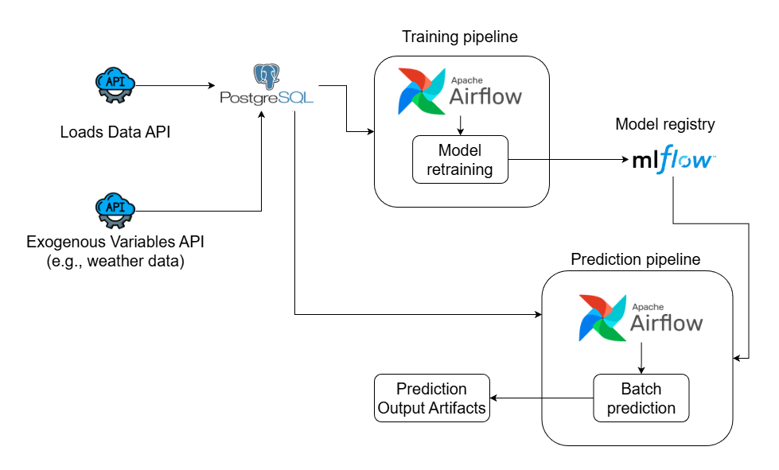
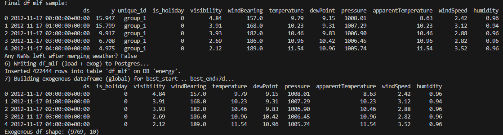
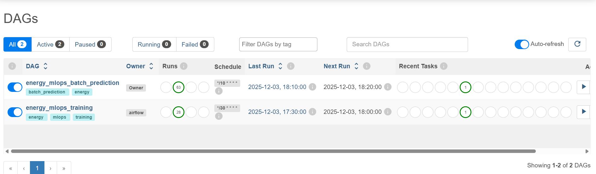
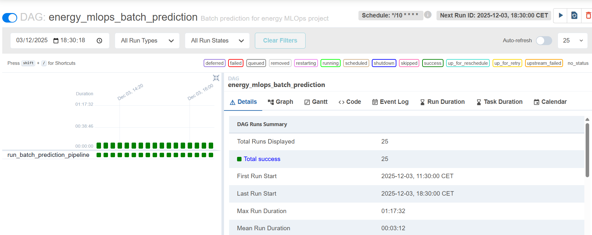
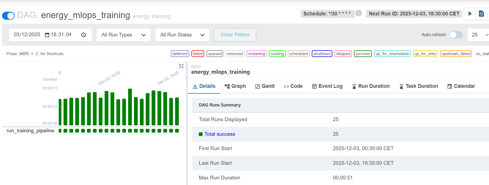
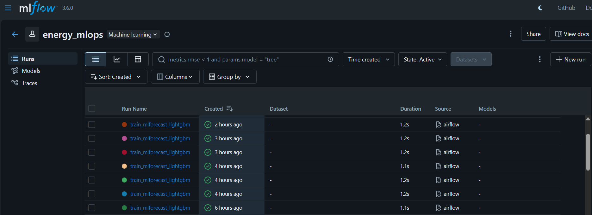
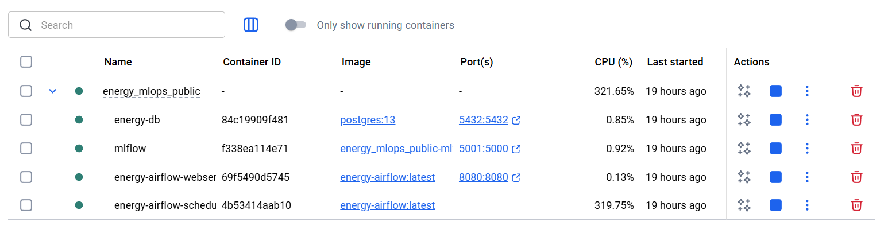

# Multiple Energy Load Forecasting – End‑to‑End MLOps (Docker + Airflow + MLflow + Postgres)



This repository contains a **production‑style, fully dockerized MLOps project** for
**short‑term energy load forecasting**.

The project is designed so that:

- The user can use it for large scale load forecasting in energy systems.
- The entire system is **config-driven**, with all settings (DB, features, models, lags, horizons) controlled via `config.yaml` and environment variables —no hard-coded values.
- Built around **MLForecast**, enabling fast, scalable time-series modeling with configurable lag transforms, rolling features, multiple model candidates, and efficient batch forecasting.
- All “real” data lives in **PostgreSQL** (no CSVs in the main pipeline)
- Training and batch prediction are orchestrated with **Airflow**
- All experiments and models are tracked in **MLflow**
- Everything can be started locally with **Docker Compose**
- You can also run the pipelines **locally (without Docker)** using a simple `.env` file

This README is intentionally **very detailed** so that:

1. A completely new user can clone the repo and get it running.
2. Future you can remember exactly how everything is wired together.
3. It documents design decisions and conventions used in the project.

---

## 0. Golden Rule of Environments

Before anything else, one clear rule (very important):

> **Local runs → `.env` → `localhost`**  
> **Docker / Airflow runs → `config.yaml` + Docker env → `energy-db`**

Concretely:

- When you run Python scripts **directly on your machine** (no Docker), you should:
  - Source `.env`
  - Connect to `DB_HOST=localhost`

- When you run inside **Docker / Airflow**:
  - The containers use environment variables from `docker-compose.yml`
  - `DB_HOST` is set to `energy-db` (the Postgres service name in Docker network)

Never mix these two worlds.  
If you see errors like “connection refused” or “host not found”, check this rule first.

---
## 1 Overview

### 1.1 Repository Structure

A simplified view of the most important files:

```text
.
├── .env                         # Local-only environment variables (for non-Docker runs)
├── docker-compose.yml           # Orchestrates Postgres + MLflow + Airflow
├── Dockerfile.airflow           # Builds the Airflow image with project code + deps
├── Dockerfile.mlflow            # Builds the MLflow tracking server image
│
├── config/
│   └── config.yaml              # Main configuration file (models, features, DB defaults...)
│
├── airflow/
│   └── dags/
│       ├── energy_training_dag.py          # Airflow DAG for training
│       └── energy_batch_prediction_dag.py  # Airflow DAG for batch prediction
│
├── energy_forecasting/
│   ├── components/
│   │   ├── data_ingestion.py              # Reads from Postgres
│   │   ├── data_transformation.py         # Feature engineering + train/test split
│   │   ├── model_trainer.py               # MLForecast training + MLflow logging
│   │   ├── model_evaluation.py            # Compare to previous best, update registry
│   │   └── batch_prediction.py            # Batch forecasting + writing predictions
│   │
│   ├── pipline/
│   │   ├── training_pipeline.py           # Orchestrates ingestion -> transform -> train -> eval
│   │   └── batch_prediction_pipeline.py   # Orchestrates batch prediction
│   │
│   ├── data_access/
│   │   └── postgres_loader.py             # Helper to connect to PostgreSQL
│   │
│   ├── configuration/
│   │   └── configuration.py               # ConfigManager: loads config.yaml + env vars
│   │
│   ├── entity/
│   │   ├── config_entity.py               # Dataclasses for config sections
│   │   └── artifact_entity.py             # Dataclasses for pipeline artifacts
│   │
│   ├── utils/
│   │   └── common.py                      # General utilities
│   │
│   ├── constants.py                       # ROOT_DIR, CONFIG_FILE_PATH, etc.
│   ├── logger.py                          # Logging configuration wrapper
│   └── exception.py                       # Custom EnergyException
│
├── scripts/
│   └── kaggle_to_db_df_mlf.py  # One‑off script: download Kaggle data -> create df_mlf & df_exog in DB
│
├── artifacts/                  # Created at runtime: ingested data, models, predictions, etc.
│   └── ...                     # (created by training / batch prediction pipelines)
│
├── notebooks/ # Interactive exploration of MLForecast + dataset
│   ├── EDA_and_modeling_MLforecast.ipynb # Dataset exploration / visualization
│   ├── batch_prediction.ipynb # predictions visualization
├── requirements.txt
├── pyproject.toml              # Package metadata (for `pip install -e .`)
└── README.md
```

### 1.2 Dataset

- This project is **not limited to a specific dataset**. Thanks to its generic, configuration-driven design, it can operate on any large-scale energy consumption dataset stored in PostgreSQL.
- For demonstration and benchmarking, we use the **Smart Meters in London** dataset from the UK Power Networks *Low Carbon London* project.
- The dataset contains electricity consumption readings for **5,567 households** collected between **2011–2014** as part of the UK’s nationwide smart-meter rollout.
- It is a **cleaned, refactored version** of the original London Datastore release and includes **electrical energy consumption**, aggregated for efficient time-series forecasting.
- In this project, loads were **clustered and aggregated by meter ID**, but the same methodology can be extended to clustering by **geographical region**, **consumption patterns**, or other user-defined grouping strategies.


### 1.3 Exploring the Data and MLForecast Models Using Notebooks

This project also includes a `notebooks/` directory where you can:

- Explore the **raw Kaggle dataset**
- Inspect the **aggregated hourly load data (df_mlf)** pulled from PostgreSQL
- Visualize **exogenous features** such as holidays and temperature
- Experiment interactively with **MLForecast models**, including:
  - Trying new lag structures
  - Adding new date-based or dynamic features
  - Comparing different forecasting models
  - Evaluating residuals, prediction errors, and seasonality patterns

These notebooks are a great way to:

- Understand how the data is transformed before entering the pipeline  
- Prototype new feature engineering ideas  
- Validate MLForecast behavior before integrating changes into the production pipeline  
- Perform quick EDA and debugging outside Airflow  
---

## 2. The `.env` File (Local‑only)

For **local** (non‑Docker) development, the repository contains a `.env` file like:

```bash
export DB_HOST=localhost
export DB_PORT=5432
export DB_NAME=energy
export DB_USER=energy_user
export DB_PASSWORD=change_me
export DB_MLF_TABLE=df_mlf
export DB_EXOG_TABLE=df_exog
export MLF_N_FILES=20
```

How to use it:

```bash
# From repo root
source .env
```

This sets all database‑related environment variables so **local Python scripts** can connect to your Postgres instance running on `localhost:5432`.

Inside Docker containers the `.env` file is **not used**.  
Instead, environment variables are defined directly in `docker-compose.yml`.

---

## 3. High‑Level Architecture

At a conceptual level:

1. **Data Source**
   - Kaggle dataset: `jeanmidev/smart-meters-in-london`
   - A one‑off ETL script (`scripts/kaggle_to_db_df_mlf.py`) downloads raw CSVs, aggregates them, and writes resulting tables to **Postgres**:

     - `df_mlf`:  
       - `unique_id`: meter / group identifier  
       - `ds`: timestamp (hourly)  
       - `y`: energy load  
       - exogenous features (holidays, weather, etc.)

     - `df_exog`:
       - `ds` (future timestamps)  
       - exogenous features that will be known in advance (e.g., holiday calendar, weather forecasts)



2. **Training Pipeline**
   - Reads last `N` hours from `df_mlf`
   - Performs feature engineering and train/test splitting
   - Trains MLForecast models with various configurations
   - Logs experiments & artifacts to **MLflow**
   - Saves trained models and metrics to the `artifacts/` directory
   - Decides whether to promote new model to “best model” registry

3. **Batch Prediction Pipeline**
   - Reads recent history from `df_mlf`
   - Reads future exogenous data from `df_exog`
   - Loads current “best model” from artifacts
   - Generates forecasts for the next `H` hours
   - Writes predictions:
     - to CSV under `artifacts/.../batch_prediction/`
     - optionally to a Postgres table (`pred_table`, if enabled in config)

4. **Orchestration**
   - **Airflow** DAGs orchestrate:
     - `energy_mlops_training` DAG → training pipeline
     - `energy_mlops_batch_prediction` DAG → batch prediction pipeline








5. **Experiment Tracking**
   - **MLflow** server (via Docker) tracks:
     - hyperparameters
     - metrics
     - artifacts (e.g. models, plots, configs)




---

## 4. Software & Tools

- **Python**: 3.12 (this project is developed and tested with 3.12)
- **PostgreSQL**: containerized in Docker
- **Airflow**: using the official Airflow images plus your project code
- **MLflow**: lightweight tracking server in Docker
- **MLForecast**: forecasting library (wrapped in `ModelTrainer`)
- **Docker & Docker Compose**: orchestrating services
- **pytest**: testing framework

---

## 5. Step‑by‑Step: Initial Setup (Both Local & Docker)

This section gathers everything you need in the correct order.

### 5.1 Install Python 3.12

Ensure that:

```bash
python3.12 --version
```

returns something like `Python 3.12.x`.

On some systems, Python 3.12 may be `python` or `python3`.  
Adjust commands accordingly.

---

### 5.2 Clone the repository

```bash
git clone https://github.com/rbahmani01/mlops_load_forecasting.git
cd mlops_load_forecasting
```

---

### 5.3 (Optional but Recommended) Create a virtual environment

```bash
python3.12 -m venv .venv
source .venv/bin/activate        # On Windows: .venv\Scripts\activate
pip install --upgrade pip
pip install -r requirements.txt
pip install -e .
```

Notes:

- `pip install -e .` installs the `energy_forecasting` package in editable mode.
- This is mainly for **local runs** and for running tests.

---

### 5.4 Set up Kaggle API

You need a Kaggle API token to download the dataset.

1. Go to Kaggle → Account → Create New API Token
2. Download `kaggle.json` and place it under `~/.kaggle/kaggle.json`
3. Or set environment variables:

```bash
export KAGGLE_USERNAME=your_kaggle_username
export KAGGLE_KEY=your_kaggle_key
```

The script `scripts/kaggle_to_db_df_mlf.py` uses these credentials.

---

### 5.5 (Local only) Load `.env`

For local runs, DB configuration is taken from `.env`:

```bash
source .env
```

You can always inspect `.env` to see / adjust your local DB configuration.

---

## 6. Building Docker Images

Before starting the full stack, you must build the images.

From the repo root:

```bash
# Build Airflow image
docker build -f Dockerfile.airflow -t energy-airflow:latest .

# Build MLflow image
docker build -f Dockerfile.mlflow -t energy-mlflow:latest .
```

After building, you can check:

```bash
docker images | grep energy-
```

You should see at least:

- `energy-airflow`
- `energy-mlflow`

---

## 7. Starting the Docker Stack

Once images are built:

```bash
docker compose up -d
```

This will start:

- `energy-db` (PostgreSQL)
- `mlflow` (MLflow tracking server)
- `energy-airflow-webserver`
- `energy-airflow-scheduler` (or equivalent service name, depending on your compose file)

You can check status:

```bash
docker ps
```



---

## 8. Fixing Permissions for `artifacts/` (Important)

When Airflow inside Docker tries to write to `./artifacts` (mounted from host), it may receive **permission denied**.

To fix this on the host machine:

```bash
sudo chmod -R 777 artifacts
```

This gives read/write/execute permissions to every user for the `artifacts` directory and its children.  
It’s fine for a local dev environment (but be more restrictive in a real production deployment).

If you forget this step, you may see errors like:

- `PermissionError: [Errno 13] Permission denied: '/opt/airflow/artifacts/...'`

---

## 9. Creating the Airflow Database in Postgres

Airflow will use a dedicated database named `airflow` inside the `energy-db` Postgres container.

After `docker compose up -d`, create it:

```bash
docker exec -it energy-db \
  psql -U energy_user -d postgres \
  -c "CREATE DATABASE airflow OWNER energy_user;"
```

Then verify:

```bash
docker exec -it energy-db \
  psql -U energy_user -d postgres -c "\l"
```

You should see a database called `airflow` with owner `energy_user`.

---

## 10. Initializing Airflow Metadata

From the repo root:

```bash
docker compose run --rm airflow-webserver airflow db init
```

What this does:

- Connects to Postgres at `energy-db`
- Creates all Airflow metadata tables inside the `airflow` database

You only need to run this **once**, unless you drop the DB.

---

## 11. Creating an Airflow Admin User

From the repo root:

```bash
docker exec -it energy-airflow-webserver \
  airflow users create \
    --username admin \
    --firstname Admin \
    --lastname User \
    --role Admin \
    --email admin@example.com \
    --password admin
```

After this, you can log into Airflow with:

- Username: `admin`
- Password: `admin`

To ensure everything is clean:

```bash
docker compose down
docker compose up -d
```

---

## 12. Populating the Database with Kaggle Data (df_mlf & df_exog)

### 12.1 Overview

The script `scripts/kaggle_to_db_df_mlf.py`:

1. Downloads the **smart meters in London** dataset from Kaggle
2. Aggregates and cleans it into an hourly dataset
3. Adds exogenous features (holidays, weather, etc.)
4. Writes two tables into Postgres (`energy-db`):
   - `df_mlf` – main historical table
   - `df_exog` – future exogenous values for forecasting

### 12.2 Running the script from project directory

The recommended way is to run it **inside** the project directory:


```bash
python3 -m scripts.kaggle_to_db_df_mlf
```

Once it finishes, you should have two tables in the `energy` database:

- `df_mlf`
- `df_exog`

You can verify from host:

```bash
docker exec -it energy-db \
  psql -U energy_user -d energy -c "\dt"
```

---

## 13. Accessing Airflow and MLflow UIs

After the stack is up and data is loaded:

- Airflow UI: <http://localhost:8080>
- MLflow UI: <http://localhost:5001>

Use the Airflow admin credentials you created:

- Username: `admin`
- Password: `admin`

---

## 14. Airflow DAGs

### 14.1 Training DAG

- **DAG ID**: `energy_mlops_training`
- **File**: `airflow/dags/energy_training_dag.py`
- **Purpose**: run the full training pipeline regularly (weekly or monthly, or 30 minutes for testing)

Steps typically include:

1. `DataIngestion` – reads last `N` hours from `df_mlf`
2. `DataTransformation` – feature engineering, train/test split
3. `ModelTrainer` – MLForecast training + MLflow logging
4. `ModelEvaluation` – compare to previous best model
5. (optional) register / update best model location in artifacts

You can **manually trigger** this DAG from the Airflow UI or rely on its schedule.

---

### 14.2 Batch Prediction DAG

- **DAG ID**: `energy_mlops_batch_prediction`
- **File**: `airflow/dags/energy_batch_prediction_dag.py`
- **Purpose**: generate regular forecasts (e.g. every 10 minutes for testing, hourly, etc.)

Typical steps:

1. Load recent history from `df_mlf`
2. Load future exogenous values from `df_exog`
3. Load best model (saved by training pipeline)
4. Predict next `H` hours
5. Save predictions:
   - to `artifacts/.../batch_prediction/predictions.csv`
   - optionally to Postgres (`pred_table`) if configured

You can change the schedule in the DAG file (cron string) to fit your use case.

---

## 15. Running Pipelines Without Docker (Local Mode)

Sometimes you want to run just the Python pipelines **locally** (e.g. for debugging, development, or unit tests).

### 15.1 Start a local Postgres

If you don’t already have a local Postgres, you can use Docker for just the DB:

```bash
docker run --name energy-db-local \
  -e POSTGRES_DB=energy \
  -e POSTGRES_USER=energy_user \
  -e POSTGRES_PASSWORD=change_me \
  -p 5432:5432 \
  -d postgres:15
```

### 15.2 Load `.env`

From repo root:

```bash
source .env
```

This sets `DB_HOST=localhost` (important for local mode).

### 15.3 Run Kaggle ETL locally (optional)

With Python venv active and `.env` loaded:

```bash
python3 -m scripts.kaggle_to_db_df_mlf
```

This will connect to `localhost:5432` and create/update `df_mlf` and `df_exog`.

---

### 15.4 Run **training pipeline** locally

```bash
python3 -c "from energy_forecasting.pipline.training_pipeline import TrainPipeline; \
TrainPipeline().run_pipeline()"
```

This will:

- Fetch data from local Postgres (`localhost`)
- Run ingestion → transformation → training → evaluation
- Store artifacts under `artifacts/<timestamp>/...`
- Log runs to:
  - the MLflow server if `MLFLOW_TRACKING_URI` is set, OR
  - local `./mlruns` if `MLFLOW_TRACKING_URI` is unset

---

### 15.5 Run **batch prediction pipeline** locally

```bash
python3 -c "from energy_forecasting.pipline.batch_prediction_pipeline import BatchPredictionPipeline; \
BatchPredictionPipeline().run_pipeline()"
```

This will:

- Load the best model from artifacts
- Read recent history from `df_mlf`
- Read future exogenous from `df_exog`
- Write predictions to `artifacts/<timestamp>/batch_prediction/` (and optionally DB)

---

## 16. Configuration – `config/config.yaml`

The `ConfigManager` loads this file and merges it with environment variables.

Typical sections (simplified):

### 16.1 Database

```yaml
database:
  hours_history: 8760    # how far back to fetch
```

### 16.2 Data Transformation

```yaml
data_transformation:
  feature_cols:
    - is_holiday
    - temperature
    # add more as needed
  test_hours: 24
```

`feature_cols` lists feature columns taken from `df_mlf`.  
`test_hours` is the number of hours to keep as test set.

### 16.3 Model Trainer (MLForecast)

```yaml
model_trainer:
  unique_id_col: unique_id
  time_col: ds
  target_col: y
  freq: 'h'

  lags: [1, 24, 168]
  max_lag: 168

  date_features:
    - "month"
    - "dayofweek"
    - "hour"

  n_windows: 3
  h: 24   # forecast horizon for evaluation

  mlf_lag_transforms:
    "1":
      - type: "ExpandingMean"
    "24":
      - type: "RollingMean"
        window_size: 48

  model_candidates:
    - name: "LightGBM"
      params:
        learning_rate: [0.05, 0.1]
        num_leaves: [31, 63]
        feature_fraction: [0.8, 1.0]
```

You can adjust:

- `lags` / `max_lag`
- `date_features`
- `model_candidates` list and their search grids

### 16.4 Batch Prediction

```yaml
batch_prediction:
  n_future_hours: 24
  pred_table: null   # or "df_predictions" if you want DB output

  exog_source:
    type: "db"
    params:
      table: df_exog
      time_col: ds
```

Change `n_future_hours` to adjust forecasting horizon.

If you want predictions stored in `df_predictions` in Postgres, set:

```yaml
pred_table: df_predictions
```

---

## 17. Logging & Exceptions

- **Logging** is configured through `energy_forecasting.logger`.  
  Use:

  ```python
  from energy_forecasting.logger import logging

  logger = logging.getLogger(__name__)
  logger.info("Something happened")
  ```

- **Exceptions** are wrapped into `EnergyException` which keeps:
  - the original error object
  - a message providing context  
  This is useful for debugging stack traces in Airflow.

---

## 18. Testing (Pytest)

The project provides lightweight, fully offline tests for core components and pipelines:

1. **Postgres URL tests**  
   - Ensure `build_postgres_url` correctly merges config values with `ENERGY_DB_*` environment overrides.

2. **DataTransformation tests**  
   - Use synthetic data to verify correct train/test time split and feature column selection.

3. **ModelTrainer tests**  
   - Validate correct construction of MLForecast lag transforms.  
   - Ensure invalid configs raise `EnergyException`.

4. **Offline TrainPipeline smoke test**  
   - Monkeypatches ingestion to use a synthetic CSV.  
   - Runs the full training pipeline without Postgres or Kaggle.

5. **Offline BatchPredictionPipeline smoke test**  
   - Stubs `psycopg2` and replaces `BatchPrediction` with a fake predictor.  
   - Ensures a predictions CSV is produced.

6. **Pipeline interface tests**  
   - Assert that both pipelines expose a callable `run_pipeline()` method.

```bash
pytest -q
```

You can also run a specific test file, e.g.:

```bash
pytest tests/test_train_pipeline_full.py -q
```

---

## 19. Troubleshooting

### 19.1 “Permission denied” writing to `artifacts/`

- Symptom: Airflow task fails with `PermissionError` when writing anything under `/opt/airflow/artifacts`.
- Fix (on host):

  ```bash
  sudo chmod -R 777 artifacts
  ```

### 19.2 “could not connect to server: Connection refused”

- Likely causes:
  - Postgres container not running
  - Using `localhost` inside Docker or `energy-db` outside Docker

- Check:
  - `docker ps` to ensure `energy-db` is up
  - For local runs, `DB_HOST` must be `localhost`
  - For Docker, DB host must be `energy-db`

### 19.3 Airflow cannot import `energy_forecasting`

- Make sure that in the Airflow Docker image:
  - The project is copied into the container
  - `pip install -e .` (or similar) is done in `Dockerfile.airflow`
  - `PYTHONPATH` includes your project root if needed

- For local Airflow (if you ever run it outside Docker):
  - Ensure the repo is installed (`pip install -e .`)
  - Ensure the repo root is in `PYTHONPATH` or site‑packages

### 19.4 MLflow UI is empty

- Ensure the training pipeline was actually run.
- Check the environment variable:

  ```bash
  echo $MLFLOW_TRACKING_URI
  ```

- In Docker:
  - `MLFLOW_TRACKING_URI` is usually `http://mlflow:5000` inside the container.
- For local usage without server:
  - If `MLFLOW_TRACKING_URI` is **not** set, MLflow writes to `./mlruns`.
  - You can inspect with:

    ```bash
    mlflow ui --backend-store-uri file://$(pwd)/mlruns
    ```

---

## 20. Typical Workflows

### 20.1 Full Dockerized Setup From Scratch

1. Clone repo
2. Build Docker images
3. `docker compose up -d`
4. `sudo chmod -R 777 artifacts`
5. Create `airflow` DB in Postgres
6. `docker compose run --rm airflow-webserver airflow db init`
7. Create Airflow admin user
8. Restart stack (`docker compose down && docker compose up -d`)
9. Exec into `energy-airflow-webserver` and run `python3 -m scripts.kaggle_to_db_df_mlf`
10. Open Airflow UI, enable DAGs, trigger training and batch prediction
11. Open MLflow UI to inspect experiments

### 20.2 Local Development and Debugging

1. Start local Postgres
2. `source .env`
3. Create venv + install requirements
4. Run Kaggle ETL locally (`python3 -m scripts.kaggle_to_db_df_mlf`)
5. Run training pipeline from Python
6. Run batch prediction pipeline from Python
7. Run `pytest` to check everything

---
